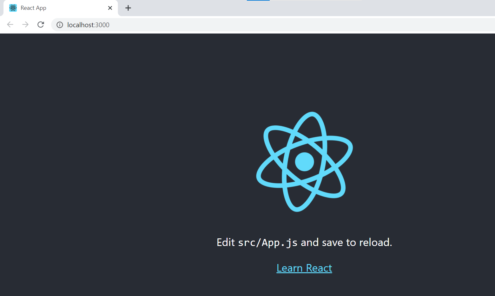

# Notes on... Build A Full-Stack Amplify Application, Using Amazon Amplify

[Source material](https://aws.amazon.com/getting-started/hands-on/build-react-app-amplify-graphql)

## Module 1: HOST REACT APP

### Create a new React Application
Run these commands from a parent/root directory that you would want to have the project
folder created. (I ran these in my Git/Bash terminal.)

For example, I've run this in: `C:\Users\Kevin\Documents`, and the `npx`
command will download and install an app, called `amplifyapp` in that directory.

```
npx create-react-app amplifyapp
cd amplifyapp
npm start
```

The last command, `npm start`, will start an empty React application at localhost:3000.
Here's what that will look like:



### Initialize Git Repository
Run these commands from within the `amplifyapp` directory.

```
git init
git remote add origin git@github.com:username/reponame.git
git add .
git commit -m “initial commit”
git push origin master
```
(Note, I used https:// protocol instead of ssl, so the second line is:   
  `git remote add origin https://github.com/kevinxperese/amplifyapp`)

### Log in to Amplify Management Console
I logged in, but then got a screen that said it would take up to 24 hours to 'fully activate'.   


Then, a week later, I went back, and clicked on 'Complete Your AWS Registration', which
asked for my phone number, to fill in a Captcha, and then I got a phone call with a PIN
to "verify" my account.

Then I needed to select a plan. (I chose the Free plan.)   


Which then took me to the AWS Management Console.   


Select AWS Amplify in the Search bar, and it will bring you to this page:   


### Deploy Your App With AWS Amplify
* Select "Get Started" button, under Deploy section.

* Select "GitHub" under "From Existing Code," (then "Continue").   

* Authorize AWS to access my GitHub account, (then sign in to my GitHub account)   


* Select repo/branch.


* Accept default build settings

* Save and Deploy (this takes a little while...)

* Then the app that we had on our localhost is being hosted on a cloud server at
https://master.da1q8echd2hj2.amplifyapp.com/


## Module 2: INITIALIZE LOCAL APP

## Module 3: ADD AUTHENTICATION

## Module 4: ADD API AND DATABASE

## Module 5: ADD STORAGE
